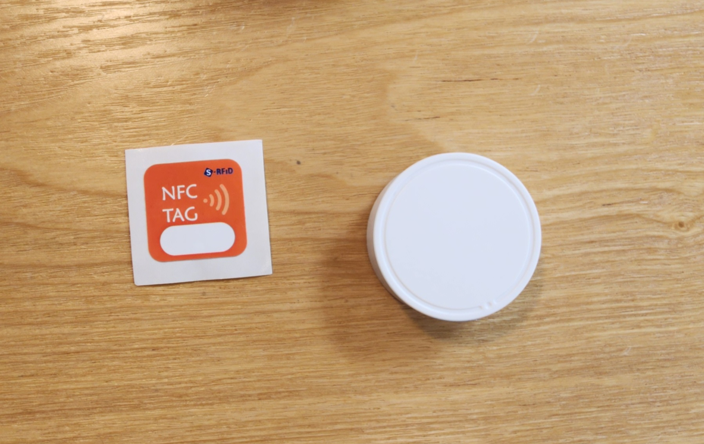
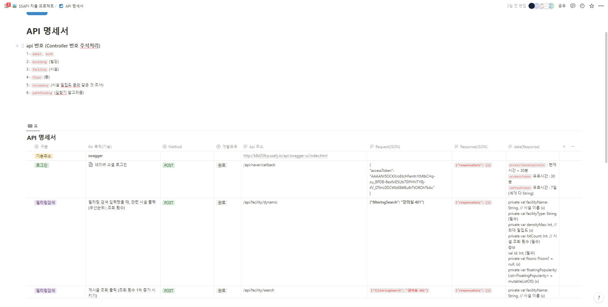
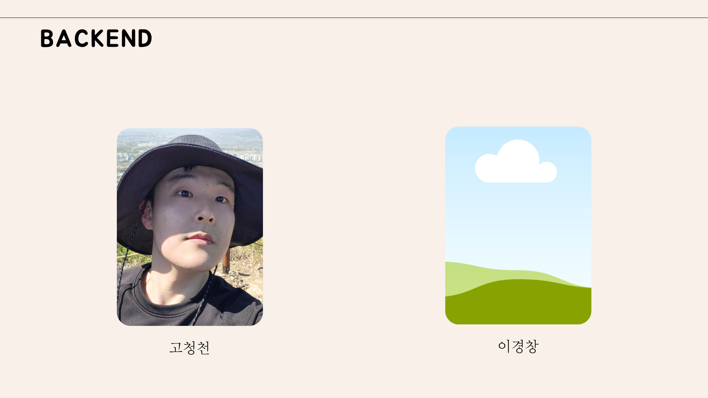

# 🗺️ PathFinder
<br>

---
## 📚 목차

1. 📆 얼마나 걸렸을까요
2. 📖 어떤 프로그램일까요
4. 📖 어떻게 동작하나요
5. ✅ 기술 스택
5. ✅ 프로젝트 파일 구조
6. ✅ 협업툴
7. ✅ 협업 환경
8. ✅ figma
9. ✅ api 개발
10. 😎 우리는요

---


<br>

---
## 📆 얼마나 걸렸을까요

**2023.04.10 ~ 2023.05.26 (6주)** <br>
**SSAFY 8기 자율프로젝트**
<br>

---
## 📖 어떤 프로그램일까요

많은 분들이 초행길은 목적지까지 찾아가기 힘들어하십니다.
내비게이션이 잘 되는 야외에서는 길을 찾는다고 하지만, GPS가 제대로 동작하지 않는 실내에서는 더욱이 길을 찾기 힘들죠 <br>

예를 들어 백화점이나 대형건물에 방문을 하실 때 화장실이나 숨어있는 엘리베이터, 원하는 매장을 한 번에 찾아가기란 힘듭니다.
그래서 저희는 Beacon과 NFC를 사용하고, Unity를 활용한 AR을 기반으로 실내에서 최적의 경로로 길을 찾을 수 있는 애플리케이션을 개발하게 되었습니다. <br>
 
NFC와 비콘을 통해서 건물 내부의 유동인구 파악, 시간별 인구 밀집도 등을 통해 마케팅 전략을 세울 수도 있고 매장 위치별 임대료 측정 등의 다양한 기대효과를 누릴 수 있을 것으로 생각하고 있습니다.

<br>

---
## 📖 어떻게 동작하나요

건물 입구에서부터 각기 다른 입구별로 배치되어 있는 각기 다른 ID 값을 가진 NFC 태깅을 통해 애플리케이션을 실행하고 현재 위치를 파악할 수 있습니다.<br>
현재 위치를 통해서 건물 입구에서 곧바로 원하는 목적지까지 입력하면 해당 목적지까지 갈 수 있는 최적의 경로를 알려줍니다.<br>
물론 입구가 아니더라도 원하는 출발지에서 목적지까지 찾아갈 수 있습니다.<br>

- _최적의 경로를 찾을 때는 A*알고리즘을 활용하여 출발지에서 목적지까지 가장 빠른 경로를 탐색하여 알려줍니다._
- _현재 위치는 Beacon과 Unity를 통해서 건물내부에서 본인의 위치를 알 수 있도록 개발했습니다._



<br>

---
## ✅ 기술 스택

**Front End**
- Android Studio : Electric eel
- Android Jetpack Compose
- Kotlin Flow
- Dagger-Hilt
- Retrofit


**Back End**
- Kotlin
- Spring boot
- JPA DATA
- Querydsl
- MySQL
- Swagger
- Spring Security
- Oauth

**CI/CD**
- Docker 
- Docker hub
- Ec2
- Nginx
- Jenkins

**AR**
- Unity
- Unity Ar Foundation


<br>

---
## ✅ 프로젝트 파일 구조

**FrontEnd**
```
  │      ├─main
  │      │  ├─java
  │      │  │  └─com
  │      │  │      └─dijkstra
  │      │  │          └─pathfinder
  │      │  │              ├─components
  │      │  │              ├─data
  │      │  │              │  └─dto
  │      │  │              ├─di
  │      │  │              ├─domain
  │      │  │              │  ├─api
  │      │  │              │  └─repository
  │      │  │              ├─navigation
  │      │  │              ├─screen
  │      │  │              │  ├─login
  │      │  │              │  ├─main
  │      │  │              │  ├─nfc_start
  │      │  │              │  ├─splash
  │      │  │              │  └─test
  │      │  │              ├─ui
  │      │  │              │  └─theme
  │      │  │              └─util
  │      │  └─res
  │      │      ├─drawable
  │      │      ├─drawable-v24
  │      │      ├─font
  │      │      ├─layout
  │      │      ├─mipmap-anydpi-v26
  │      │      ├─mipmap-hdpi
  │      │      ├─mipmap-mdpi
  │      │      ├─mipmap-xhdpi
  │      │      ├─mipmap-xxhdpi
  │      │      ├─mipmap-xxxhdpi
  │      │      ├─values
  │      │      └─xml
  │      └─test
  │          └─java
  │              └─com
  │                  └─dijkstra
  │                      └─pathfinder
  ├─build
  │  └─kotlin
  │      └─sessions
  └─gradle
      └─wrapper
```

**BackEnd**
```
└─src
    ├─main
    │  ├─kotlin
    │  │  └─ssafy
    │  │      └─autonomous
    │  │          └─pathfinder
    │  │              ├─domain
    │  │              │  ├─administrator
    │  │              │  │  ├─controller
    │  │              │  │  ├─domain
    │  │              │  │  ├─dto
    │  │              │  │  │  └─baseEntities
    │  │              │  │  └─repository
    │  │              │  ├─auth
    │  │              │  │  ├─controller
    │  │              │  │  ├─dto
    │  │              │  │  │  ├─request
    │  │              │  │  │  └─response
    │  │              │  │  ├─exception
    │  │              │  │  ├─filter
    │  │              │  │  ├─oauth
    │  │              │  │  ├─security
    │  │              │  │  └─service
    │  │              │  ├─building
    │  │              │  │  ├─controller
    │  │              │  │  ├─domain
    │  │              │  │  ├─dto
    │  │              │  │  │  ├─request
    │  │              │  │  │  └─response
    │  │              │  │  ├─exception
    │  │              │  │  ├─repository
    │  │              │  │  └─service
    │  │              │  ├─facility
    │  │              │  │  ├─controller
    │  │              │  │  ├─domain
    │  │              │  │  ├─dto
    │  │              │  │  │  ├─request
    │  │              │  │  │  └─response
    │  │              │  │  ├─exception
    │  │              │  │  ├─repository
    │  │              │  │  └─service
    │  │              │  ├─floors
    │  │              │  │  ├─controller
    │  │              │  │  ├─domain
    │  │              │  │  ├─dto
    │  │              │  │  │  └─request
    │  │              │  │  ├─exception
    │  │              │  │  ├─repository
    │  │              │  │  └─service
    │  │              │  ├─occupancy
    │  │              │  │  ├─controller
    │  │              │  │  ├─domain
    │  │              │  │  └─dto
    │  │              │  └─pathfinding
    │  │              │      ├─controller
    │  │              │      ├─dto
    │  │              │      └─service
    │  │              ├─global
    │  │              │  ├─common
    │  │              │  │  └─response
    │  │              │  ├─config
    │  │              │  └─util
    │  │              └─test
    │  │                  └─controller
    │  └─resources
    └─test
        └─kotlin
            └─ssafy
                └─autonomous
                    └─pathfinder
                        └─domain
                            ├─auth
                            │  └─service
                            ├─building
                            │  └─service
                            ├─facility
                            │  └─service
                            ├─floors
                            │  └─service
                            └─pathfinding
                                └─service
```


<br>

---
## ✅ 협업툴

- Git
- Notion
- Jira
- Discord
- Figma
- MatterMost


<br>

---
## ✅ 협업 환경
- GItlab
    - 코드 버전 관리
    - MR를 통한 코드 리뷰
    - git flow 전략
    
- JIRA
    - 매주 목표 설정
    - 스프린트를 통해서 팀원이 현재 하고 있는 작업 확인
    - 번다운 차트를 통해서 한주의 작업 분석

- Notion
    - 프로젝트 일정 관리
    - 회의록 정리
    - 컨벤션 정리
    - 기능 명세서 정리
    - API 및 ERD 문서 정리
    - 각종 자료 공유

- 스크럼
    - 매일 아침 약 10분 내외로 각자의 진행상황 등을 공유


<br>

---

## ✅ Figma


<br>

---
## ✅ API 개발




<br>

---
## 😎 우리는요

### FrontEnd


<br>

### BackEnd



<br>
<br>


